# CX II Power Path: Implemented Logic (Source of Truth)

This document describes the power-path logic as it is currently implemented in code, not as intended by old notes.

Primary implementation files:

-   `/Users/ck/dev/firebird/core/peripherals/misc.c` (rail model, charger state, ADC synthesis)
-   `/Users/ck/dev/firebird/core/soc/cx2.cpp` (PMU/PMIC register projection)
-   `/Users/ck/dev/firebird/core/usb/usb_cx2.cpp` (USB physical attach gating)
-   `/Users/ck/dev/firebird/core/power/powercontrol.cpp` (UI/runtime override behavior)
-   `/Users/ck/dev/firebird/mainwindow.cpp` and `/Users/ck/dev/firebird/ui/widgets/hwconfig/hwconfigwidget.cpp` (override initialization/reset)

## 1. Top-Level Data Flow

```mermaid
flowchart TB
  %% ═══════════════════════════════════════════════════════
  %%  PHYSICAL INPUTS
  %% ═══════════════════════════════════════════════════════
  subgraph IN["User-Provided Physical Inputs"]
    direction LR

    subgraph IN_BAT["Battery"]
      VBAT[/"VBAT (mV)<br/>range: 0–4200"/]
      BAT_PRES["battery_present: true | false"]
    end

    subgraph IN_USB["Top USB Port"]
      VBUS[/"VBUS (mV)<br/>0 or 4500–5250"/]
      USB_TYPE["usb_type: none | SDP | CDP | DCP | OTG"]
      USB_ATT["usb_attached: true | false"]
    end

    subgraph IN_DOCK["Dock / Sled"]
      VSLED[/"VSLED (mV)<br/>0 or 4500–5250"/]
      DOCK_ST["dock_attached: true | false"]
    end

    RESET(["Reset event<br/>battery_pull | watchdog | button"])
    ONKEY(["ON key event"])
    RTC_ALRM(["RTC alarm event"])
  end

  %% ═══════════════════════════════════════════════════════
  %%  INPUT QUALIFICATION
  %% ═══════════════════════════════════════════════════════
  subgraph QUAL["Input Qualification (separate checks)"]
    direction LR
    BAT_PRESENT_OK{"battery_present?"}
    BAT_RUN_OK{"VBAT >= VBAT_RUN_MIN"}
    BAT_PRECHG{"VBAT < VBAT_PRECHARGE_MIN"}
    USB_OK{"usb_attached AND usb_type!=none AND VBUS >= VBUS_VALID_MIN"}
    DOCK_OK{"dock_attached AND VSLED >= VSLED_VALID_MIN"}
  end

  VBAT --> BAT_RUN_OK
  VBAT --> BAT_PRECHG
  BAT_PRES --> BAT_PRESENT_OK
  VBUS --> USB_OK
  USB_TYPE --> USB_OK
  USB_ATT --> USB_OK
  VSLED --> DOCK_OK
  DOCK_ST --> DOCK_OK

  %% ═══════════════════════════════════════════════════════
  %%  SOURCE ARBITRATION + INPUT CAPABILITY
  %% ═══════════════════════════════════════════════════════
  subgraph ARB["Source Arbitration (firmware/PMIC policy-driven)"]
    direction TB
    CAP["source_capability:<br/>SDP=500mA, CDP/DCP~1500mA, OTG=charge_inhibit,<br/>dock capability from dock state"]
    POLICY["policy_select_source:<br/>usb | dock | battery | none<br/>(depends on thermals, charge state, source capability, OS policy)"]
    SRC_OUT(["source_in_use"])
    CAP --> POLICY --> SRC_OUT
  end

  USB_OK --> CAP
  USB_TYPE --> CAP
  DOCK_OK --> CAP
  BAT_PRESENT_OK --> POLICY
  BAT_RUN_OK --> POLICY
  USB_OK --> POLICY
  DOCK_OK --> POLICY

  %% ═══════════════════════════════════════════════════════
  %%  VSYS MODEL (DETAILED, APPROXIMATION)
  %% ═══════════════════════════════════════════════════════
  subgraph VSM["VSYS Derivation Model (approximation with explicit path logic)"]
    direction TB
    U_PATH["Vusb_path = USB_OK ? clamp(VBUS - USB_PATH_DROP_MV, 0, VSYS_EXT_TARGET_MV) : 0"]
    D_PATH["Vdock_path = DOCK_OK ? clamp(VSLED - DOCK_PATH_DROP_MV, 0, VSYS_EXT_TARGET_MV) : 0"]
    B_PATH["Vbat_path = BAT_PRESENT_OK ? max(VBAT - BAT_PATH_DROP_MV, 0) : 0"]
    EXT_SEL["Vext_sel =<br/>if source_in_use==usb then Vusb_path<br/>else if source_in_use==dock then Vdock_path<br/>else 0"]
    VSYS["VSYS = max(Vext_sel, Vbat_path)"]
    PG["power_good = VSYS >= VSYS_PGOOD_MIN"]
    UVLO["uvlo_trip = VSYS < VSYS_UVLO_MIN"]
  end

  SRC_OUT --> EXT_SEL
  USB_OK --> U_PATH
  DOCK_OK --> D_PATH
  BAT_PRESENT_OK --> B_PATH
  U_PATH --> EXT_SEL
  D_PATH --> EXT_SEL
  EXT_SEL --> VSYS
  B_PATH --> VSYS
  VSYS --> PG
  VSYS --> UVLO

  %% ═══════════════════════════════════════════════════════
  %%  CHARGE-PATH CONTROLLER
  %% ═══════════════════════════════════════════════════════
  subgraph CHG["Charge-Path Controller"]
    direction LR
    subgraph CHG_SM["Charge State Machine"]
      direction TB
      CS_IDLE["IDLE<br/>no usable external source"]
      CS_NOCH["CONNECTED_NOT_CHARGING<br/>source valid, charging inhibited"]
      CS_PRE["PRECHARGE<br/>VBAT < VBAT_PRECHARGE_MIN"]
      CS_CC["CONSTANT_CURRENT"]
      CS_CV["CONSTANT_VOLTAGE"]
      CS_DONE["DONE"]
      CS_FAULT["FAULT"]

      CS_IDLE -->|"ext source valid + charge allowed"| CS_PRE
      CS_IDLE -->|"ext source valid + charge inhibited"| CS_NOCH
      CS_NOCH -->|"charge allowed"| CS_PRE
      CS_NOCH -->|"source removed"| CS_IDLE
      CS_PRE -->|"VBAT >= precharge threshold"| CS_CC
      CS_CC -->|"VBAT approaches CV target"| CS_CV
      CS_CV -->|"termination current reached"| CS_DONE
      CS_PRE -->|"fault/timeout"| CS_FAULT
      CS_CC -->|"fault/timeout"| CS_FAULT
      CS_CV -->|"fault/timeout"| CS_FAULT
      CS_DONE -->|"VBAT droops"| CS_CC
      CS_FAULT -->|"reset/recover"| CS_IDLE
    end
    CHG_FLAGS(["charge_state"])
  end

  SRC_OUT --> CHG_SM
  CAP --> CHG_SM
  BAT_PRECHG --> CHG_SM
  CHG_SM --> CHG_FLAGS

  %% ═══════════════════════════════════════════════════════
  %%  DERIVED OUTPUTS / STATUS FLAGS
  %% ═══════════════════════════════════════════════════════
  subgraph PP["Derived Power/Status Outputs"]
    direction TB
    BLEVEL["battery_level_class:<br/>critical | low | medium | full"]
    WAKE["wake_reason_flags:<br/>USB insert, dock insert, ON key, RTC, reset"]
    SRCFLAG["source_flags:<br/>usb_present, dock_present, battery_present"]
  end

  BAT_RUN_OK --> BLEVEL
  RESET --> WAKE
  ONKEY --> WAKE
  RTC_ALRM --> WAKE
  USB_OK --> SRCFLAG
  DOCK_OK --> SRCFLAG
  BAT_PRESENT_OK --> SRCFLAG

  %% ═══════════════════════════════════════════════════════
  %%  SYSTEM DOMAINS
  %% ═══════════════════════════════════════════════════════
  subgraph DOM["System Power Domains"]
    direction LR
    subgraph DOM_AON["Always-On Domain"]
      RTC["RTC"]
      WAKE_CTRL["Wake controller"]
      PMU_REGS["PMU registers"]
    end
    subgraph DOM_CORE["Core Domain"]
      CPU["ARM926EJ-S"]
      SDRAM["SDRAM"]
      NAND["NAND Flash"]
    end
    subgraph DOM_PER["Peripheral Domains"]
      LCD_CTL["LCD controller"]
      USB_PHY["USB PHY / FOTG210"]
      KEYPAD["Keypad scanner"]
      TPD["Touchpad"]
      WLAN["WLAN"]
    end
  end

  VSYS -->|"valid VSYS"| DOM_AON
  PG -->|"domain enable"| DOM_CORE
  VSYS -->|"when ungated"| DOM_CORE
  VSYS -->|"clock/power gated"| DOM_PER

  %% ═══════════════════════════════════════════════════════
  %%  SYSTEM POWER STATES
  %% ═══════════════════════════════════════════════════════
  subgraph PSTATE["System Power States (guest-visible)"]
    direction LR
    S_OFF(["OFF"])
    S_STBY(["STANDBY"])
    S_DOFF(["DISPLAY_OFF_USB"])
    S_WDISP(["WAKEUP_DISPLAY"])
    S_RUN(["ACTIVE"])
  end

  PG --> PSTATE
  UVLO --> PSTATE
  WAKE --> PSTATE

  %% ═══════════════════════════════════════════════════════
  %%  ADC MODEL
  %% ═══════════════════════════════════════════════════════
  subgraph ADC_BLK["ADC Measurement Model"]
    direction TB
    ADC_MAP["channel_map:<br/>confirmed: ADC6=VBUS, ADC7=VSLED<br/>other channels: TBD by firmware validation"]
    ADC_REF["reference rails: VREF, VREF2 (separate modeled rails)"]
    ADC_CONV["10-bit conversion:<br/>code = quantize(Vinput/VREF) + noise(±LSB) + offset_cal"]
  end

  VBAT -.->|"analog tap"| ADC_MAP
  VBUS -.->|"analog tap"| ADC_MAP
  VSLED -.->|"analog tap"| ADC_MAP
  VSYS -.->|"analog tap"| ADC_MAP
  ADC_REF --> ADC_CONV
  ADC_MAP --> ADC_CONV

  %% ═══════════════════════════════════════════════════════
  %%  PMU FIRMWARE LOOP (FEEDBACK)
  %% ═══════════════════════════════════════════════════════
  subgraph PMU["PMU Firmware Loop"]
    direction TB
    PMU_TRIG["triggers:<br/>periodic poll + IRQ/events"]
    PMU_EVAL["evaluate:<br/>source validity, battery class, thermal/charge conditions, wake conditions"]
    PMU_ACT["act:<br/>update policy, charge enable/current, power flags, wake/shutdown transitions"]
    PMU_TRIG --> PMU_EVAL --> PMU_ACT
  end

  ADC_CONV -->|"ADC codes"| PMU_TRIG
  CHG_FLAGS --> PMU_EVAL
  SRC_OUT --> PMU_EVAL
  WAKE --> PMU_TRIG

  PMU_ACT -->|"update selection policy"| POLICY
  PMU_ACT -->|"update charge control"| CHG_SM
  PMU_ACT -->|"assert/deassert power flags"| PG
  PMU_ACT -->|"state transition command"| PSTATE

  %% ═══════════════════════════════════════════════════════
  %%  STYLE (high-contrast, non-purple)
  %% ═══════════════════════════════════════════════════════
  classDef input fill:#D9F2FF,stroke:#0B6FA4,color:#06263A,stroke-width:1.5px
  classDef qual fill:#FFF3D6,stroke:#C67A00,color:#3A2500,stroke-width:1.5px
  classDef pwr fill:#E3F7E8,stroke:#2E8B57,color:#113322,stroke-width:1.5px
  classDef dom fill:#EAF0FF,stroke:#3559A8,color:#1A2A57,stroke-width:1.5px
  classDef adc fill:#FFE3EE,stroke:#C23A6B,color:#4A1027,stroke-width:1.5px
  classDef pmu fill:#FFF9CC,stroke:#B28A00,color:#3E3200,stroke-width:1.5px
  classDef state fill:#DFF7F2,stroke:#0E8C79,color:#073A33,stroke-width:1.5px

  class VBAT,BAT_PRES,VBUS,USB_TYPE,USB_ATT,VSLED,DOCK_ST,RESET,ONKEY,RTC_ALRM input
  class BAT_PRESENT_OK,BAT_RUN_OK,BAT_PRECHG,USB_OK,DOCK_OK qual
  class SRC_OUT,VSYS,PG,UVLO,CHG_FLAGS,BLEVEL,WAKE,SRCFLAG pwr
  class RTC,WAKE_CTRL,PMU_REGS,CPU,SDRAM,NAND,LCD_CTL,USB_PHY,KEYPAD,TPD,WLAN dom
  class ADC_MAP,ADC_REF,ADC_CONV adc
  class PMU_TRIG,PMU_EVAL,PMU_ACT pmu
  class S_OFF,S_STBY,S_DOFF,S_WDISP,S_RUN state
```

## 2. Input Semantics

All power decisions are derived from override accessors in `/Users/ck/dev/firebird/core/emu.h`.

### 2.0 Key Constants (current code)

| Constant | Value | Meaning |
|----------------------|---------------------------:|----------------------|
| `CX2_BATTERY_MV_MIN` | 3000 | minimum modeled battery rail |
| `CX2_BATTERY_MV_MAX` | 4200 | maximum modeled battery rail |
| `CX2_BATTERY_RUN_MV_MIN` | 3300 | minimum battery to run without external rail |
| `CX2_BATTERY_PRECHARGE_MV` | 3000 | precharge threshold |
| `CX2_VBUS_VALID_MV_MIN` | 4500 | valid external USB rail threshold |
| `CX2_VSLED_VALID_MV_MIN` | 4500 | valid dock rail threshold |
| `CX2_USB_PATH_DROP_MV` | 200 | modeled USB path drop |
| `CX2_DOCK_PATH_DROP_MV` | 200 | modeled dock path drop |
| `CX2_BAT_PATH_OFFSET_MV` | +50 | battery path offset in VSYS model |
| `CX2_VSYS_PGOOD_MV_MIN` | 3200 | power-good threshold |
| `CX2_AUX_ADC_FULL_SCALE_MV` | 6820 | full scale for VBUS/VSYS/VSLED code model |
| `CX2_ADC_CODE_MAX` | 1023 | 10-bit clamp for synthesized ADC/PMU codes |

### 2.1 Battery

-   `battery_present`:
    -   override set: use override
    -   override unset: default `true`
-   `battery_mv`:
    -   override set: clamp `[3000, 4200]`
    -   override unset: default `4200`

### 2.2 USB

USB is considered physically attached only if:

-   not OTG cable, and
-   cable override says connected, and
-   `vbus_mv >= 4500`

If no explicit cable override exists, only explicit `vbus_mv` can make USB attached. Default is disconnected.

### 2.3 Dock/Sled

-   dock attached:
    -   override set: use override
    -   unset: default `false`
-   `vsled_mv`:
    -   override set: clamp `[0, 5500]`
    -   unset: default `0`
    -   dock attached does not imply rail power

## 3. Qualification and Source Selection

From `/Users/ck/dev/firebird/core/peripherals/misc.c`:

-   `usb_ok = usb_attached && !usb_otg && vbus_mv >= 4500`
-   `dock_ok = dock_attached && vsled_mv >= 4500`
-   source selection priority:
    1.  USB
    2.  Dock
    3.  Battery (if present)
    4.  None

This is strict priority, not load-sharing.

## 4. VSYS Model

Modeled paths:

-   `Vusb_path = clamp(vbus_mv - 200, 0, 5500)` if `usb_ok`, else `0`
-   `Vdock_path = clamp(vsled_mv - 200, 0, 5500)` if `dock_ok`, else `0`
-   `Vbat_path = clamp(battery_mv + 50, 0, 5500)` if battery present, else `0`

Selected external path:

-   USB source -\> `Vusb_path`
-   Dock source -\> `Vdock_path`
-   otherwise `0`

Final:

-   `vsys_mv = max(selected_external_path, Vbat_path)`
-   `power_good = (vsys_mv >= 3200)`

## 5. Charger State Logic

Charger state is computed in `/Users/ck/dev/firebird/core/peripherals/misc.c` and now has a hard external-power gate:

1.  If no valid external rail (`!usb_ok && !dock_ok`) -\> `CHARGER_DISCONNECTED`
2.  Else if explicit charger override set -\> use it
3.  Else if no battery present or OTG -\> `CHARGER_CONNECTED_NOT_CHARGING`
4.  Else if precharge (`battery_mv < 3000`) or `battery_mv < 4180` -\> `CHARGER_CHARGING`
5.  Else -\> `CHARGER_CONNECTED_NOT_CHARGING`

This gate prevents stale state from showing charging when physically disconnected.

## 6. ADC Synthesis

### 6.1 Battery code model

Battery conversion currently uses a guest-facing linear code domain:

-   Formula: `code = clamp((battery_mv * 704 + 1500) / 3000, 0, 1023)`
-   Representative points:
    -   3000 mV -\> code \~704
    -   3859 mV -\> code \~905
    -   4000 mV -\> code \~939

This mapping is tuned for TI-Nspire BattInfo tracking and is intentionally different from the old `663@3000 / 885@4000` notes.

### 6.2 Auxiliary channel scaling

For VBUS / VSYS / VSLED:

-   full scale modeled as 6820 mV over 10-bit code range
-   intended to match DIAGS-scale behavior

### 6.3 Channel map used by guest/DIAGS

Top-level ADC bank (`0x900B0000` region) is projected as:

-   ADC1: LBAT
-   ADC2: VDD3.3 (fixed nominal code)
-   ADC3: VSYS
-   ADC4: VDD1.8 (fixed nominal code)
-   ADC5: VDD1.2 (fixed nominal code)
-   ADC6: VBUS
-   ADC7: VSLED

## 7. PMU / PMIC Register Projection

From `/Users/ck/dev/firebird/core/soc/cx2.cpp`:

-   TG2989/TG2985 status is refreshed from `cx2_external_power_present()`, which requires qualified external rails (`usb_ok || dock_ok`) from the power model.
-   PMU disable0 readback:
    -   bit `0x400`: battery present
    -   bit `0x100`: external source present (`cx2_external_power_present()`)
-   PMU disable1 readback:
    -   source-voltage field synthesized from `cx2_external_source_mv()` so stale scratch bits cannot report absurd source mV values
-   PMU USB PHY status:
    -   base `0x2` when no external power
    -   upgraded to `0xE` only when external power is present and battery present

This keeps the charge icon and PMU status path aligned with physical rails.

## 8. GPIO and USB Attach Gating (Why this matters for charge state)

### 8.1 GPIO detect lines

From `/Users/ck/dev/firebird/core/peripherals/misc.c`:

-   CX II detect lines are modeled on port2 bits:
    -   bit3: cradle detect
    -   bit4: USB present
    -   bit5: WLAN detect (active-low)
    -   bit6: cradle power
-   these are forced as hardware inputs (`forced input mask = 0x78` on port2 only)
-   unmodeled CX II GPIO inputs default high to avoid false attached states from unknown mappings

### 8.2 USB controller attach events

From `/Users/ck/dev/firebird/core/usb/usb_cx2.cpp`:

-   reset and IRQ paths are gated by `usb_cx2_physical_vbus_present()`
-   if disconnected, attach/enable style IRQs are suppressed

This reduces false guest USB attach sequences that can otherwise drive power/charge state machines.

## 9. Runtime Override Behavior

From `/Users/ck/dev/firebird/core/power/powercontrol.cpp` and UI wiring:

-   `Disconnected` USB mode forces:
    -   `usb_cable_connected = 0`
    -   `vbus_mv = 0`
    -   OTG off
-   `Computer`/`Charger` modes force:
    -   `usb_cable_connected = 1`
    -   `vbus_mv = 5000`
    -   OTG off
-   dock off forces `vsled_mv = 0`

On startup, `/Users/ck/dev/firebird/mainwindow.cpp` normalizes stale persisted values so disconnected means zero external rail.

## 10. Expected Log Behavior

### 10.1 Disconnected boot

Expected:

-   batt stats mode should be `Running` (not `Charge USB`)
-   source mV should be near zero
-   PMU external source bits should remain clear

### 10.2 USB connected boot

Expected:

-   batt stats mode may show `Charge USB`
-   VBUS should be in valid range
-   PMU/TG2989 external power status should switch to USB variant

### 10.3 Recent observed behavior (2026-02-20)

-   USB mode toggles (`Disconnected` \<-\> `Charger Power Only`) now transition external-power reporting coherently; no longer stuck on always-connected.
-   BattInfo voltage tracks override closely but not exactly; example:
    -   override `3859mV` -\> BattInfo reports `3872mV` (`Running 0mV 3872mV 3872mV 75%`)

## 11. Known Simplifications

-   No thermal model
-   No dynamic charge current taper beyond simple thresholds
-   No full analog noise/settling model
-   Source arbitration is strict-priority and simplified

## 12. Debug Checklist

If charge icon is wrong:

1.  Verify external rails from `cx2_get_power_rails` path (`vbus_mv`, `vsled_mv`)
2.  Verify `usb_ok` / `dock_ok` inputs in `cx2_build_power_model`
3.  Verify PMU projected bits (`disable0` bit `0x100`, USB PHY status)
4.  Verify USB physical attach gating in `usb_cx2_physical_vbus_present`
5.  Verify no stale overrides persisted in UI/startup path