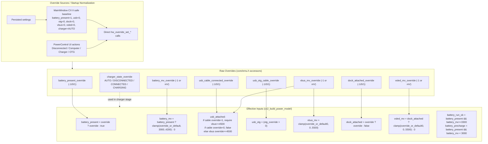
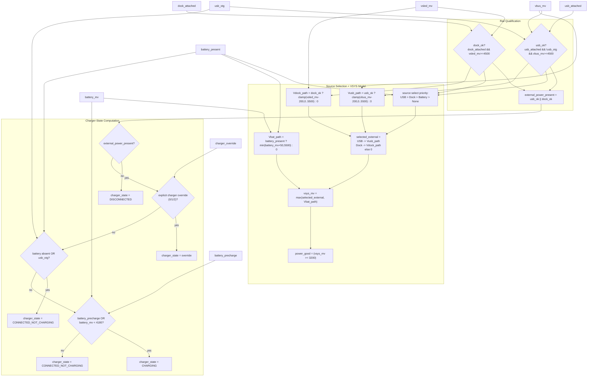
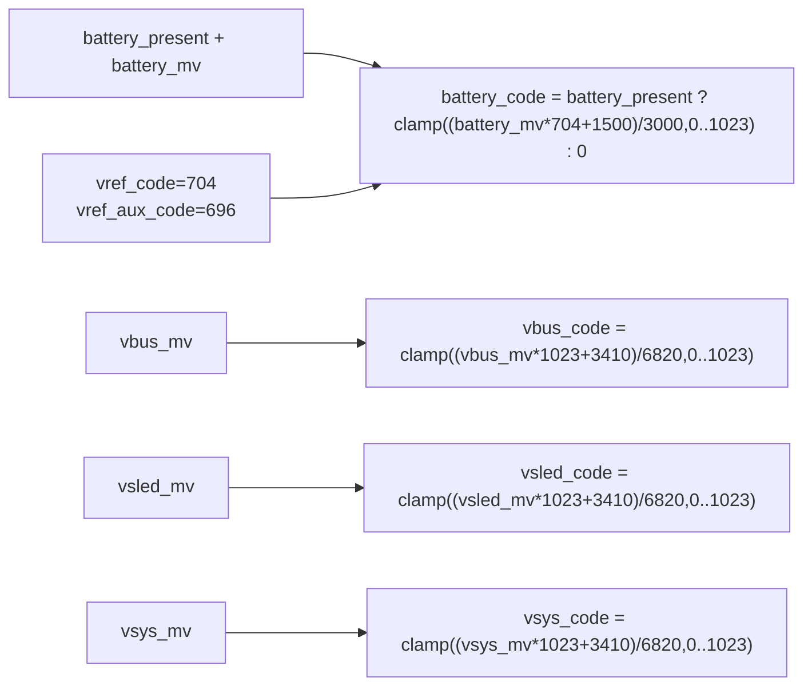

# CX II Power Path: Current Point-to-Point Model (Source of Truth)

This document tracks what the emulator currently does in code for CX II power behavior.
It is intentionally implementation-first and point-to-point.

Primary implementation files:

- `core/peripherals/misc.c` (effective inputs, qualification, VSYS/charger model, ADC projection)
- `core/soc/cx2.cpp` (PMU/TG2989 register projection from model outputs)
- `core/usb/usb_cx2.cpp` (USB physical-attach gating)
- `core/power/powercontrol.cpp` (runtime UI/source overrides)
- `mainwindow.cpp` (startup normalization of persisted overrides)

## 1. Point-to-Point Flow (Layered View)

Large single-canvas Mermaid diagrams become hard to read. This keeps the same detail,
split into focused stages.

Interactive/viewer options:

- Source files: `docs/diagrams/powerpath/`
- Details: `docs/diagrams/powerpath/README.md`
- Open `.mmd` files in VS Code Mermaid preview (pan/zoom)
- Paste `.mmd` files into `https://mermaid.live`
- Render local SVGs with `./tools/render_powerpath_diagrams.sh`

### 1.1 Stage Map

Source: `docs/diagrams/powerpath/01-stage-map.mmd`  
Rendered SVG (if generated): `docs/diagrams/powerpath/01-stage-map.svg`

### 1.2 A-B: Override Sources to Effective Inputs

Source: `docs/diagrams/powerpath/02-overrides-to-effective-inputs.mmd`  
Rendered SVG (if generated): `docs/diagrams/powerpath/02-overrides-to-effective-inputs.svg`

### 1.3 C: Qualification, VSYS, Charger

Source: `docs/diagrams/powerpath/03-qualification-vsys-charger.mmd`  
Rendered SVG (if generated): `docs/diagrams/powerpath/03-qualification-vsys-charger.svg`

### 1.4 D: ADC / Rail Code Synthesis

Source: `docs/diagrams/powerpath/04-adc-code-synthesis.mmd`  
Rendered SVG (if generated): `docs/diagrams/powerpath/04-adc-code-synthesis.svg`

### 1.5 E: Projection Surfaces (Registers + Signals)

Source: `docs/diagrams/powerpath/05-projection-surfaces.mmd`  
Rendered SVG (if generated): `docs/diagrams/powerpath/05-projection-surfaces.svg`

```mermaid
flowchart TB
  subgraph OUT_ADC["ADC register surface (0x900B0000)"]
    direction LR
    OA1["+0x00/+0x04 batt"]
    OA2["+0x0C vsys"]
    OA3["+0x18 vbus"]
    OA4["+0x1C vsled"]
    OA5["channel windows:<br/>0x100 + chan*0x20 + 0x10"]
  end

  subgraph OUT_PMU["PMU register surface (0x90140000)"]
    direction LR
    OP1["+0x20 disable0:<br/>0x400 batt_present, 0x100 ext_present"]
    OP2["+0x50 disable1:<br/>src_code bits[17:6] from external source mV"]
    OP3["+0x60 disable2:<br/>batt_code bits[15:6], charger bits[17:16]"]
    OP4["+0x858 usb phy status:<br/>0x2 base, 0xE when ext+battery"]
  end

  subgraph OUT_TG["TG2989 PMIC (0x90100000)"]
    direction LR
    OT1["+0x08/+0x30/+0x48 power status/mode/flags"]
    OT2["battery profile or external-power profile"]
  end

  subgraph OUT_GPIO["GPIO detect lines (port2)"]
    direction LR
    OG1["bit3 dock detect"]
    OG2["bit4 usb plug present"]
    OG3["bit6 dock power detect"]
    OG4["forced-input mask 0x78"]
  end

  subgraph OUT_USB["USB core attach gating (usb_cx2.cpp)"]
    direction LR
    OU1["usb_cx2_physical_vbus_present()<br/>same physical rules as qualified USB path"]
    OU2["suppress attach/reset IRQ behavior when physically disconnected"]
  end

  A2["battery_code"] --> OA1
  A5["vsys_code"] --> OA2
  A3["vbus_code"] --> OA3
  A4["vsled_code"] --> OA4
  A2 --> OA5
  A3 --> OA5
  A4 --> OA5
  A5 --> OA5

  E1["battery_present"] --> OP1
  Q3["external_power_present"] --> OP1
  SRC["external source mV (max valid USB/Dock)"] --> OP2
  A2 --> OP3
  CHG["charger_state"] --> OP3
  Q3 --> OP4
  E1 --> OP4

  Q3 --> OT2
  OT2 --> OT1

  E6["dock_attached"] --> OG1
  E3["usb_attached"] --> OG2
  E7["vsled_mv"] --> OG3
  OG1 --> OG4
  OG2 --> OG4
  OG3 --> OG4

  E3 --> OU1
  E4["usb_otg"] --> OU1
  E5["vbus_mv"] --> OU1
  OU1 --> OU2
```

## 2. Constants Used by the Model

From `core/peripherals/misc.c`:

| Constant | Value | Notes |
| --- | ---: | --- |
| `CX2_BATTERY_MV_MIN` | 3000 | battery override clamp min |
| `CX2_BATTERY_MV_MAX` | 4200 | battery override clamp max |
| `CX2_BATTERY_RUN_MV_MIN` | 3300 | `battery_run_ok` threshold (computed, not currently used for gating) |
| `CX2_BATTERY_PRECHARGE_MV` | 3000 | precharge threshold |
| `CX2_VBUS_VALID_MV_MIN` | 4500 | valid USB rail threshold |
| `CX2_VSLED_VALID_MV_MIN` | 4500 | valid dock rail threshold |
| `CX2_USB_PATH_DROP_MV` | 200 | USB path drop |
| `CX2_DOCK_PATH_DROP_MV` | 200 | dock path drop |
| `CX2_BAT_PATH_OFFSET_MV` | +50 | battery contribution to VSYS model |
| `CX2_VSYS_PGOOD_MV_MIN` | 3200 | power-good threshold |
| `CX2_AUX_ADC_FULL_SCALE_MV` | 6820 | VSYS/VBUS/VSLED ADC scaling |
| `CX2_ADC_CODE_MAX` | 1023 | 10-bit ADC clamp |

## 3. Override Inputs and Defaults

All power decisions come from `hw_override_get_*` accessors in `core/emu.h`.

### 3.1 Effective defaults when override is unset (`-1`)

- battery present: `true`
- battery mV: `4200`
- USB cable: disconnected (unless explicit VBUS override is provided)
- OTG cable: off
- VBUS rail: `0`
- dock attached: `false`
- VSLED rail: `0`
- charger state override: `CHARGER_AUTO` (automatic)

### 3.2 Startup normalization (`mainwindow.cpp`)

For CX II startup, persisted overrides are normalized to a safe baseline:

- battery present forced to `1`
- USB cable forced to `0`
- OTG forced to `0`
- dock forced to `0`
- VBUS and VSLED normalized to `0` when disconnected
- charger state forced to `CHARGER_AUTO`

This prevents stale saved settings from booting as "externally powered" by mistake.

### 3.3 Runtime UI behavior (`core/power/powercontrol.cpp`)

`setUsbPowerSource()` updates overrides directly:

- `Disconnected` -> cable `0`, OTG `0`, VBUS `0`
- `Computer` -> cable `1`, OTG `0`, VBUS `5000`, USB link connected
- `Charger` -> cable `1`, OTG `0`, VBUS `5000`, USB link reset (no data session)
- `OTG` -> cable `0`, OTG `1`, VBUS `0`

Dock detach also forces `vsled_mv = 0`.

## 4. Effective Input Derivation

From `cx2_build_power_model()` in `core/peripherals/misc.c`:

- `battery_present`:
  - override set -> explicit 0/1
  - unset -> `true`
- `battery_mv`:
  - present -> clamp override to `[3000, 4200]`, else default `4200`
  - absent -> `0`
- `usb_attached`:
  - override cable `1` requires `vbus_mv >= 4500`
  - override cable `0` is detached
  - no cable override: explicit VBUS override can still indicate attached if `>= 4500`
- `usb_otg`: true if OTG override > 0
- `dock_attached`:
  - override set -> explicit 0/1
  - unset -> `false`
- `vsled_mv`:
  - dock attached + override set -> clamp `[0, 5500]`
  - otherwise `0`

## 5. Qualification and Source Selection

Qualification:

- `usb_ok = usb_attached && !usb_otg && vbus_mv >= 4500`
- `dock_ok = dock_attached && vsled_mv >= 4500`

Source priority for external-path selection:

1. USB
2. Dock
3. Battery
4. None

Important: this is strict priority for external-path selection, not load-sharing.

## 6. VSYS and Charger-State Computation

### 6.1 VSYS model

- `Vusb_path = clamp(vbus_mv - 200, 0, 5500)` if `usb_ok`, else `0`
- `Vdock_path = clamp(vsled_mv - 200, 0, 5500)` if `dock_ok`, else `0`
- `Vbat_path = battery_present ? min(battery_mv + 50, 5500) : 0`
- `selected_external = Vusb_path` for USB source, `Vdock_path` for dock source, else `0`
- `vsys_mv = max(selected_external, Vbat_path)`
- `power_good = (vsys_mv >= 3200)`

### 6.2 Charger-state logic

`external_power_present = usb_ok || dock_ok`

Then:

1. if no external power -> `CHARGER_DISCONNECTED`
2. else if explicit charger override is `DISCONNECTED/CONNECTED_NOT_CHARGING/CHARGING` -> use override
3. else if battery absent or OTG set -> `CHARGER_CONNECTED_NOT_CHARGING`
4. else if `battery_precharge` or `battery_mv < 4180` -> `CHARGER_CHARGING`
5. else -> `CHARGER_CONNECTED_NOT_CHARGING`

Notes:

- `battery_precharge` is defined as `battery_mv < 3000`, but battery mV is clamped to `>=3000`, so this branch is effectively dormant with current clamps.
- Charging is hard-gated by valid external rails, so stale state cannot show charging while disconnected.

## 7. Output Projection Paths

### 7.1 ADC projection (`0x900B0000`)

Battery code:

- `battery_code = clamp((battery_mv * 704 + 1500) / 3000, 0, 1023)` when battery present

Aux rail code (VBUS/VSYS/VSLED):

- `code = clamp((mv * 1023 + 3410) / 6820, 0, 1023)`

Top sample slots:

- `+0x00`: batt
- `+0x04`: batt (ADC1 LBAT)
- `+0x08`: 655 (ADC2 VDD3.3 nominal)
- `+0x0C`: VSYS code (ADC3)
- `+0x10`: 725 (ADC4 VDD1.8 nominal)
- `+0x14`: 476 (ADC5 VDD1.2 nominal)
- `+0x18`: VBUS code (ADC6)
- `+0x1C`: VSLED code (ADC7)

Channel-window result registers (`0x100 + chan*0x20 + 0x10`) are kept coherent with the same live model.

### 7.2 PMU + TG2989 projection (`core/soc/cx2.cpp`)

`0x90140020` (`disable0`) readback:

- bit `0x400` set when battery present
- bit `0x100` set when `cx2_external_power_present()` is true

`0x90140050` (`disable1`) readback:

- source-voltage code synthesized from `cx2_external_source_mv()`:
  - `src_code = clamp((src_mv * 1008 + 1650) / 3300, 0, 0xFFF)`
  - stored in bits `[17:6]`
- external source mV chooses the larger of valid USB and valid dock rails

`0x90140060` (`disable2`) readback:

- battery code in bits `[15:6]` using the same battery code formula
- charger state bits `[17:16]`: `00` disconnected, `01` connected/not charging, `11` charging
- unrelated firmware-owned bits are preserved

`0x90140858` USB PHY status:

- base `0x2`
- returns `0xE` only when external power present and battery present

TG2989 PMIC minimal status (`0x90100000` block):

- power status/mode/flags switch between battery and external-power variants based on `cx2_external_power_present()`

### 7.3 GPIO detect lines (`core/peripherals/misc.c`)

On CX II, port2 input bits are synchronized as hardware inputs:

- bit3 (`0x08`): dock attached detect (active high)
- bit4 (`0x10`): USB plug present (active high)
- bit5 (`0x20`): WLAN detect (modeled as absent -> line high)
- bit6 (`0x40`): dock power detect (active high, separate from dock attach)

Forced input mask for port2 is `0x78`, so guest cannot drive these pins as outputs.

### 7.4 USB controller attach gating (`core/usb/usb_cx2.cpp`)

`usb_cx2_physical_vbus_present()` uses the same physical conditions:

- OTG -> not externally powered
- cable override `1` requires `vbus >= 4500`
- cable override `0` detached
- no cable override: explicit `vbus >= 4500` may indicate attached

Reset and attach-related IRQ signaling is suppressed when physically disconnected to avoid false guest attach flows.

## 8. What This Model Intentionally Does Not Do

- No thermal model
- No charge-current taper curve
- No dynamic load-sharing between USB and dock (strict priority for VSYS external path)
- No emulator-side forced shutdown on low battery (guest firmware decides based on ADC/PMU values)

## 9. Point-to-Point Validation Checklist

1. Confirm overrides (`battery/usb/dock/vbus/vsled/otg`) are in expected states.
2. Inspect `cx2_get_power_rails()` outputs (`battery_mv`, `vsys_mv`, `vbus_mv`, `vsled_mv`, `charger_state`).
3. Verify PMU bits:
   - `0x90140020` bit `0x100` tracks external power
   - `0x90140060` charger bits match computed charger state
4. Verify USB attach path:
   - disconnected -> no attach-style reset IRQ behavior
   - connected with valid VBUS -> attach/reset behavior appears
5. Cross-check guest behavior (boot messages/status icon) against these modeled rails and bits.
